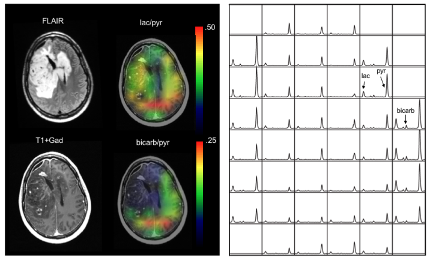
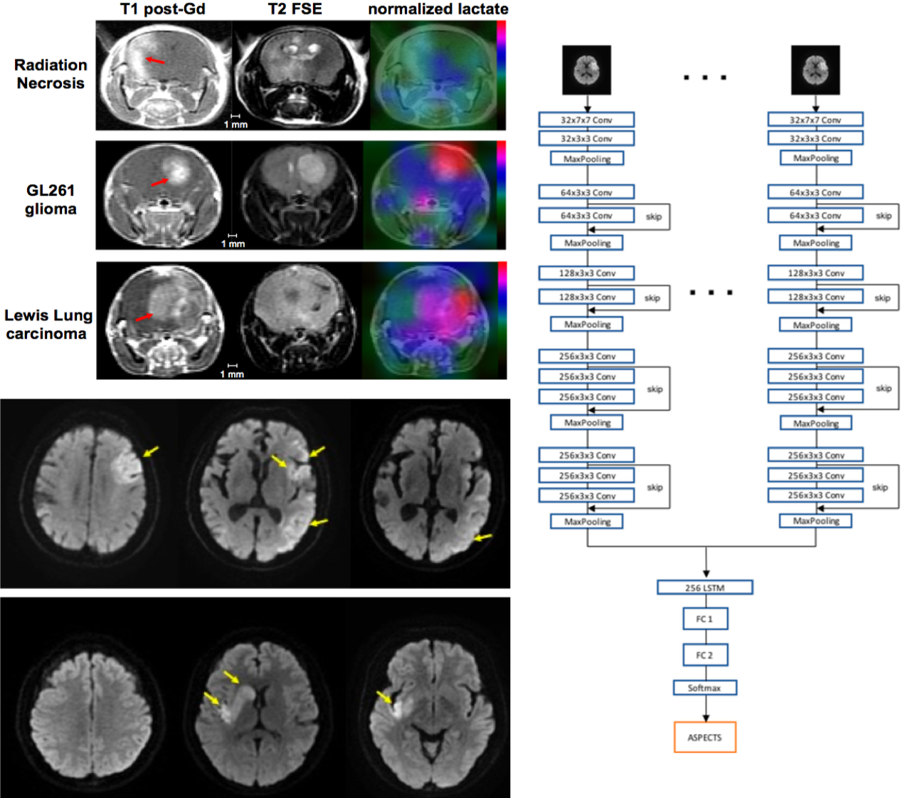

  

    

    

    

    <h4><b>Head of LabMI: Prof. Ilwoo Park</b></h4>
      
<b>Associate Professor</b>, Chonnam National University 
      Department of Artificial Intelligence Convergence, College of Engineering 
      Department of Radiology, College of Medicine

      
Email: <a href= "mailto: ipark@chonnam.edu" style="color: #0000FF;"> ipark@chonnam.edu </a>, <a href= "mailto: ipark@jnu.ac.kr" style="color: #0000FF;"> ipark@jnu.ac.kr </a>

      
LabMI at Chonnam University runs by Prof. Ilwoo Park. The goal of our research is to advance our understanding of diseases using advanced imaging methods combined with artificial intelligence technology. Our laboratory has two main research focus: &emsp;1- Development of machine learning/deep learning-based methods for application to clinical data, including medical imaging and EMR (electronic medical record) &emsp;2- Development of new imaging techniques and imaging biomarkers using magnetic resonance imaging (MRI) 

    

 

 

  

  

  

    

    <a href="research/index.html">
    <h6 style="font-weight:bold;color:#00618F;text-align: center;">Ongoing Research</h6></a>
    

        

    <a href="team/index.html"> 
    <h6 style="font-weight:bold;color:#00618F;text-align: center;">Our Team </h6></a>
    

    

    <a href="publications/index.html">
    <h6 style="font-weight:bold;color:#00618F;text-align: center;">Publications</h6></a>
    

  

  

 

